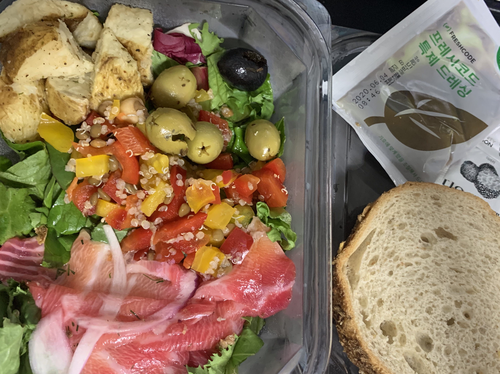

## 샐러드 식단

[프레시코드](https://www.freshcode.me/)를 통해 샐러드를 먹은지 1주일 정도 됬네요.
처음 2~3일간은 등이 굽는 듯한 느낌을 받았으나 이제 해졌습니다.

아직 일주일 밖에 되지 않았지만 샐러드를 먹기 이전보다 **훨씬 맑은 정신**을 유지할 수 있게 됬습니다.
덕분에 개인 프로젝트에 투자할 수 있는 시간도 늘어났습니다.
회사 업무 생산성도 증가했다고 생각합니다.

다만 아직까지 이 샐러드만 먹고 본격적인 운동을 하기엔 좀 더 시간이 필요할 것 같습니다.
몸이 아직 체내 저장된 에너지를 효과적으로 사용하기엔 연약하네요.
한 달 정도 지나면 샐러드를 먹고 난 뒤 시간이 좀 지나더라도 활력이 넘치면 좋겠습니다.

## 나이키 트레이닝 클럽

코로나 이후 집에만 틀어박히고 사람을 많이 만나지도 못해서 몸이 많이 망가졌습니다. (사실 그 전부터 처참했습니다.)
이를 극복하기 위해 [나이키 트레이닝 클럽](https://apps.apple.com/kr/app/nike-training-club/id301521403)으로 천천히 몸의 기동성과 유연성을 회복하고 있습니다.
지금은 거의 마사지나 워밍업 수준의 루틴만 하는데도 벅찬 느낌입니다.

심폐력은 정말 최악이어서 일단 걷기라도 해야겠네요.
식후에 하는게 제일 좋은 타이밍이라고 생각하는데 여름이라서 힘들겠습니다.
밤에 조금이라도 걸어보는게 좋겠네요.

## 청소

주거환경을 깨끗하게 유지하면 멘탈에 도움이 된다는 걸 알았습니다.
작년 말에 이사하고 나서 이전 집 보다는 훨씬 깨끗하게 유지하고 있는데
삶의 질이 달라지네요.

1. 청소거리를 모았다가 일괄 처리하는 대신 평소에 조금씩 청크를 분리해서 작업하기
2. 필요 없는 물건 빠르게 버리기
3. 식사 후 먹은 다음 바로 설거지 / 청소하기

위 사항들을 최대한 지키고 있습니다.
